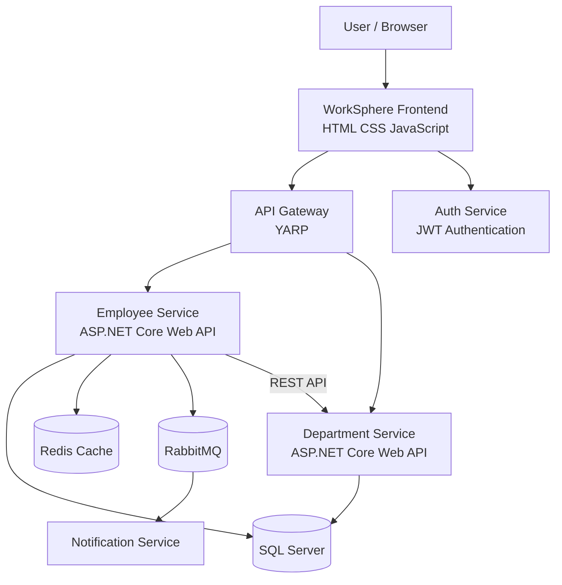

# WorkSphere – Enterprise Workforce Management Platform

WorkSphere is a .NET-based workforce management platform built using a microservices architecture.

## 🚀 Features

- Employee Management
- Department Management
- JWT Authentication
- API Gateway using YARP
- Redis Caching
- RabbitMQ Event Messaging
- Notification Service
- SQL Server with Entity Framework Core
- Docker & Docker Compose
- HTML, CSS & JavaScript Frontend
- Centralized Exception Handling
- REST-based Inter-Service Communication

## 🏛️ System Architecture

## 🧩 **Version Details**

| Technology | Version |
|---|---|
| .NET / ASP.NET Core | 10.0.12 |
| SQL Server | 2022 |
| Redis | latest |
| RabbitMQ | 3-management |
| Docker Engine | 29.7.2 |
| Docker Compose | v5.5.1 |
| API Gateway | YARP |
| Frontend | HTML, CSS, JavaScript |
| ORM | Entity Framework Core |

## 🛠️ **Technologies**

| Category | Technology |
|---|---|
| Frontend | HTML, CSS, JavaScript |
| Backend | C#, .NET 10, ASP.NET Core Web API |
| ORM | Entity Framework Core |
| Database | SQL Server 2022 |
| Authentication | JWT |
| API Gateway | YARP |
| Caching | Redis |
| Messaging | RabbitMQ |
| Architecture | Microservices |
| Containerization | Docker, Docker Compose |
| Version Control | Git, GitHub |

## 📋 **Prerequisites**

Before running WorkSphere locally, make sure the following are installed:

- Git
- Docker Desktop
- Docker Engine 29.7.2 or later
- Docker Compose v5.5.1 or later

Make sure Docker Desktop is running before starting the application.

🔐 Environment Configuration

WorkSphere requires environment variables for the database, RabbitMQ, and JWT authentication.

Create a .env file in the root directory of the repository:

WORKSPHERE_DB_PASSWORD=your_secure_database_password
RABBITMQ_PASSWORD=your_rabbitmq_password
WORKSPHERE_JWT_KEY=your_long_secure_jwt_key

Do not commit the .env file to GitHub. Keep your passwords and JWT key private.

🚀 Local Setup
1. Clone the Repository

Open PowerShell or Terminal and run:

git clone https://github.com/Afan77912/WorkSphere.git
cd WorkSphere
2. Create the Environment File

Create a .env file in the root directory of the project and add the required environment variables shown above.

3. Build and Start the Application

Make sure Docker Desktop is running, then execute:

docker compose up --build

Docker Compose will build and start the WorkSphere services and required infrastructure.

4. Verify Running Containers

Open a new PowerShell or Terminal window and run:

docker ps

Make sure the WorkSphere containers are running successfully.

5. Access the Application

Once the containers are running, use the following URLs:

Component	URL
WorkSphere Frontend	http://localhost:7060
API Gateway	http://localhost:7151
Employee Service	http://localhost:7206
Department Service	http://localhost:7235
Auth Service	http://localhost:7091
RabbitMQ Management	http://localhost:15672

📸 Screenshots
WorkSphere Frontend

Docker Containers

👨‍💻 Developer

Afan Dalvi
B.E. Computer Engineering – 2026
Pune, India
